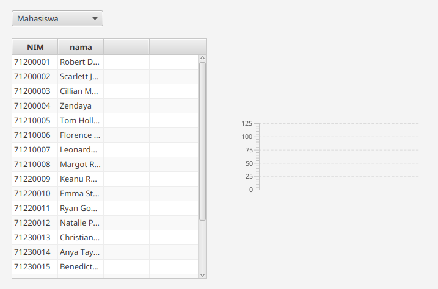
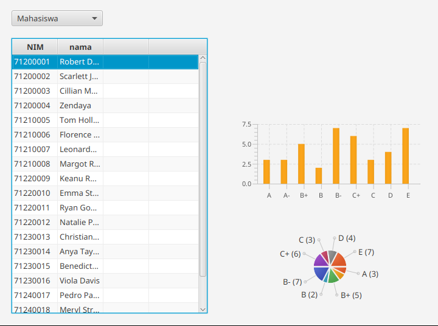
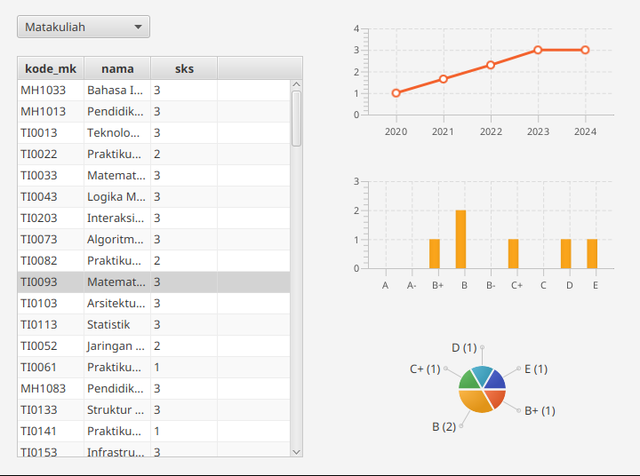

# UG 9

3 tabel pada database:
- mahasiswa(String nim, String nama).
- matakuliah(String kode_mk, String nama, int sks).
- nilai(String kode_mk, String nim, String nilai).

tugas kalian adalah membuat fitur jika user click data pada tabel maka chart akan menampilkan data nilainya.

### Tabel mahasiswa:

- Barchart: Menampilkan berapa banyak nilai A,A-,B+,...
- Barchart: Menampilkan berapa banyak nilai A,A-,B+,...
- linechart: -

### Tabel matakuliah:

- Barchart: Menampilkan berapa banyak nilai A,A-,B+,... 
- Barchart: Menampilkan berapa banyak nilai A,A-,B+,...
- linechart: Menampilkan nilai mean per-angkatan

### Ketentuan:
1. akses data di database menggunakan method yang sudah di sediakan.
2. Kerjakan TODO pada AppController jangan ganti code yang lain.

### Penilaian:
<table>
    <tbody>
        <tr>
            <td>Barchart Mahasiswa</td>
            <td>20%</td>
        </tr>
        <tr>
            <td>Piechart Mahasiswa</td>
            <td>20%</td>
        </tr>
        <tr>
            <td>Linechart Matakuliah</td>
            <td>20%</td>
        </tr>
        <tr>
            <td>Barchart Matakuliah</td>
            <td>20%</td>
        </tr>
        <tr>
            <td>Piechart Matakuliah</td>
            <td>20%</td>
        </tr>
        <tr>
            <td></td>
            <td>100%</td>
        </tr>
    </tbody>
</table>